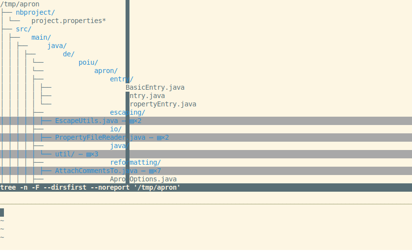

# vim-tree

**vim-tree** integrates good old [tree(1)](http://mama.indstate.edu/users/ice/tree) into
Vim and Nvim for all common operating systems.

The plugin provides a single command, `:Tree`. It is perfect
for quickly navigating and exploring complex directory hierarchies.

## Changes to upstream

This is a (largely modified) clone of http://github.com/mhinz/vim-tree.
The following changes are made to upstream:

- Support the usage of trees `-h` option that shows the file size along
  with the file name. The change provides syntax highlighting for the file
  size and does not consider it being a part of the file name.
- Provide a mapping to open a terminal in the selected directory
- Provide a mapping to lcd to the parent directory and call tree again with
  the same options.
- Provide a mapping to lcd to the previously visited directory and call
  tree again with the same options.
- Provide a mapping to reload the current tree with the same options.
  This also tries to restore the fold states (can be disabled since it is
  rather slow on huge trees).
- Nicer foldtext to not break readability when some lines are folded.
  Also the first line of the fold is the first line of the _content_ of a
  directory, not the directory itself. This enhances readability even more.
  To still be able to operate on folds the same way as before some fold
  mappings are changed when called on a directory entry to instead operate
  on the fold in the next line (the content of the directory).
- Correctly syntax highlight directory names with spaces.
- Syntax highlight the tree indicators.
- Support multiple simultaneous tree buffers.
- Provide option `g:tree_default_options` to specify default options
  (defaults to `--dirsfirst --noreport`). The options `-n -F` are always
  set regardless of this new option as they are needed for vim-tree to work
  correctly.
- Change mappings `s`, `v`, `t` to differntiate between files and
  directories. For directories they now open a new tree of the selected entry in
  the corresponding window/tab instead of netrw.
- Change mapping `e` to open netrw for the selected entry in a vertical
  split in case it is a directory.
- Allow tree buffers to be hidden (and reused later on)
- Introduce a workaround for repeating the search. It didn't proceed if a
  search was found on the current line.

## Screencasts

### Basic Usage

### Advanced Usage

### Folding

### Reloading Tree


## Installation

Use your favorite plugin manager. E.g. [vim-plug](https://github.com/junegunn/vim-plug):

    Plug 'mhinz/vim-tree'

Then restart Vim and `:PlugInstall`.

## Dependencies

[tree](http://mama.indstate.edu/users/ice/tree) needs to be installed.

#### Ubuntu/Debian

    $ sudo apt-get install tree

#### macOS

    $ brew install tree

#### Windows

1. Download the [win32 tree binary zip archive](http://downloads.sourceforge.net/gnuwin32/tree-1.5.2.2-bin.zip) and unzip it.
1. Move `tree.exe` from the `bin` directory to the directory containing your
   `vim.exe` or `nvim.exe`. E.g. `C:\Program Files (x86)\Vim\vim81\`.

## Usage

There is only one command: `:Tree`.

That command defaults to `tree -n -F --dirsfirst --noreport`. It takes optional
arguments that will simply be added to the default, so `:Tree -a` will run `tree
-n -F --dirsfirst --noreport -a`.

The default options can be modified by setting the option
`g:tree_default_options` (see below). However, `-n` and `-F` will always be
included as they are necessary for vim-tree to correctly operate.

Use <kbd>?</kbd> in the tree buffer to get a list of all mappings.

## Options

- `g:tree_default_options`  
  Default options to use when calling `:Tree`
  without any arguments. Defaults to `--dirsfirst --noreport`.

- `g:tree_remember_fold_state`  
  Reloading a tree with `r` tries to restore
  the fold states. In huge trees that can take quite some time (up to
  several seconds). Disabling restoring the fold states (by setting this
  option to 0) will avoid that performance penalty.

- `g:tree_enable_folding`  
  Set a foldexpr for folding directory contents. The first line of the fold
  is the first line of the _content_ of the directory, not the directory
  name itself. However the default fold mappings are modified to also
  operate on the directory entry.
  
## Tips

- For huge directories you might want to set a limit, e.g. `:Tree -L 3`.
- If many files have spaces in their names, `:Tree -Q` might provide more
  readable output.

---

To keep a navigator-like window open:

```vim
:leftabove 40vnew | Tree
```

Then use `p` to open the current entry in the previous window.

---

## Customization

- The tree buffer sets the `tree` filetype.
- `tree#GetPath()` returns the path of the current entry.

Stupid example:

```vim
autocmd FileType tree
      \ autocmd CursorMoved <buffer> execute 'pedit' tree#GetPath()
```

Now, every time you move the cursor to a file, it will be shown in the preview
window.

## Author and Feedback

If you like this plugin, star it! It's a great way of getting feedback. The same
goes for reporting issues or feature requests.
